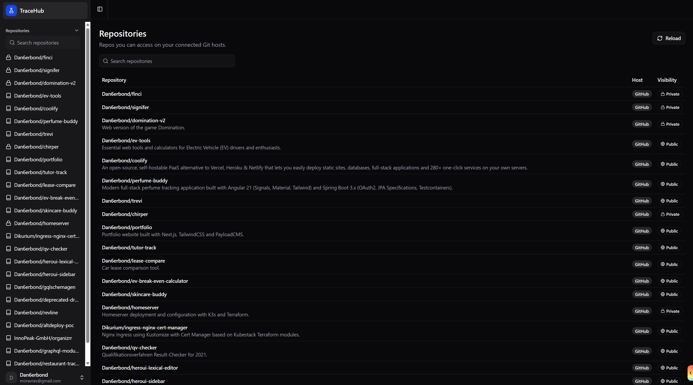
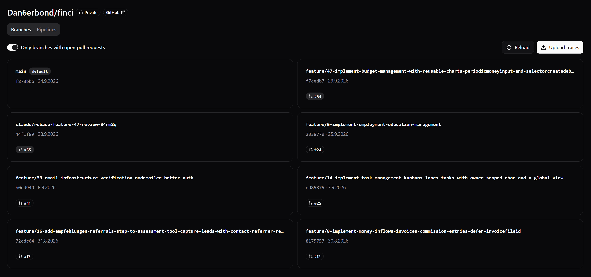
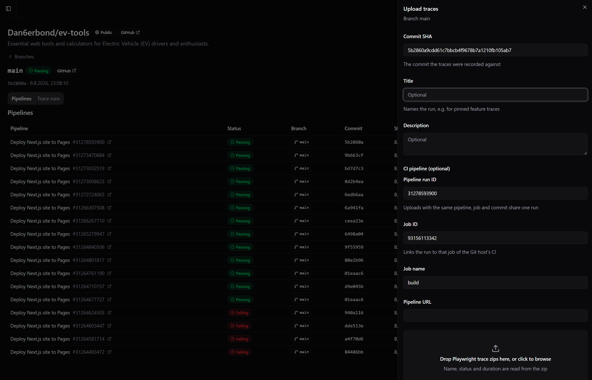
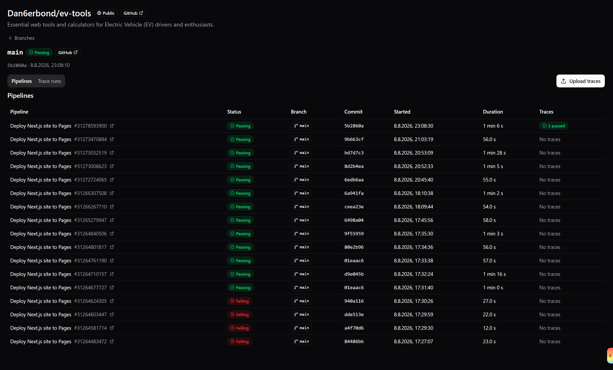
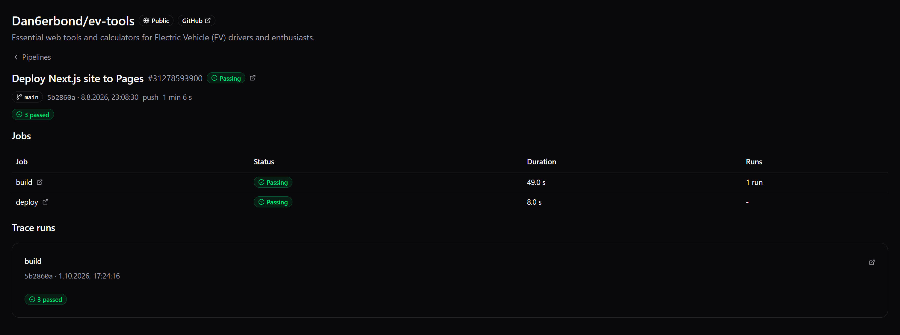
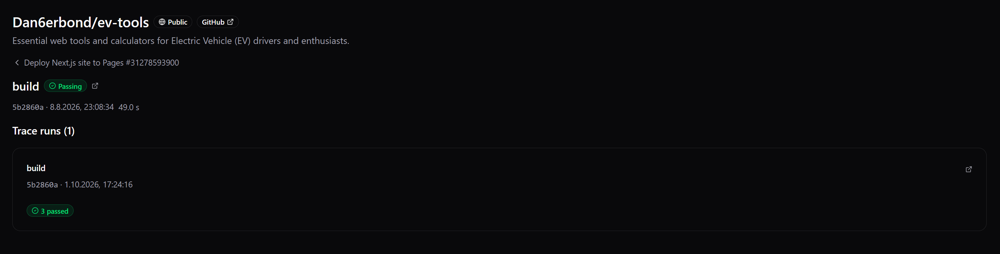
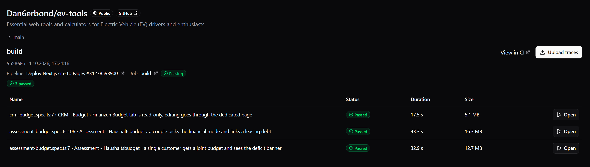
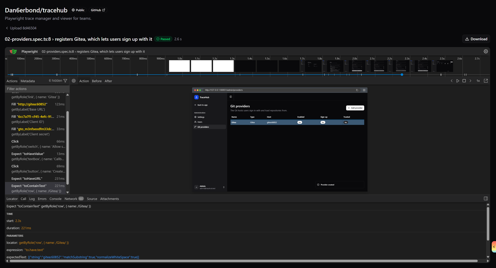

# TraceHub

TraceHub is a Drone CI-style app for Playwright traces. Users sign in with their Git host, see the repositories they have access to, and browse uploaded traces by branch, pull request, pipeline and job. Traces open in an embedded Playwright trace viewer.

- Sign in with GitHub, GitHub Enterprise, Gitea or Forgejo, or with username and password.
- Repositories and permissions are inherited from the Git host. TraceHub has no permission model of its own.
- Traces are grouped by branch, pull request, CI pipeline and CI job, with links back to the host's pages.
- Self-hostable: a TanStack Start app on top of a Convex deployment, authenticated with Better Auth.

## Screenshots

### Repositories

The repositories you can access on your connected Git hosts, with host and visibility. Reload re-syncs them from the hosts.



### Branches

Branches of a repository with their latest commit and open pull request. A toggle limits the list to branches with open pull requests. Pipelines are one tab over.



### Uploading traces

Traces can be uploaded from the UI as Playwright trace zips. Name, status and duration are read from the zip. The commit SHA is required, and the optional CI fields (pipeline run ID, job ID, job name, pipeline URL) attach the upload to a pipeline and job.



### Pipelines with traces

The CI pipelines of a branch as reported by the Git host, with status, commit, duration and a summary of the traces uploaded for each.



### Pipeline jobs and trace runs

A pipeline lists its jobs with status, duration and number of trace runs, followed by the trace runs uploaded for the pipeline.



### Job with trace runs

A single job with the trace runs uploaded for it and links to the pipeline and the job on the host.



### Traces of a run

The traces of one run with status, duration and size. Each opens in the trace viewer.



### Trace viewer

The Playwright trace viewer embedded in TraceHub, with the trace zip also available for download.



## How it works

### Git providers

Git providers are registered at runtime by an admin, not through environment variables. Several providers of the same type are possible (for example two Gitea instances).

- Supported types: GitHub (github.com and GitHub Enterprise), Gitea and Forgejo.
- Each provider has an immutable slug (also the Better Auth provider ID), a display name, a base URL, an optional API URL override, and an OAuth client ID and secret. The secret is stored encrypted and is never returned to the client.
- The admin UI shows the OAuth callback URL (`<SITE_URL>/api/auth/callback/<slug>`) and a setup guide per provider type to register the OAuth application on the host.
- A provider can be enabled or disabled, can allow sign-up, and can be marked as trusted for linking. Only trusted providers may implicitly link an OAuth sign-in to an existing account with the same verified email. Untrusted providers link only through an explicit link from the user's profile.

### First run and admin

- The first user to register becomes admin. While no user exists, the login page redirects to `/initial-setup`, which creates that admin account and then points to the admin area to register a Git provider.
- The admin area has settings (global registration toggle for password and OAuth sign-up), users (create, role, ban, reset password, delete) and providers (create, edit, setup guides, trusted for linking).
- Users can link further Git accounts from their profile and sign in with them afterwards.

### Repository sync

- After sign-in, TraceHub calls the host's API with the user's token to list their repositories. Reload re-syncs repositories, branches, open pull requests, the most recent CI pipelines and the jobs of branch and PR heads.
- Access always goes through the host's permissions.
- Links into the host (repository, branch, commit, pull request, pipeline, job) are derived in Convex from the provider's current base URL and the host's URL scheme, never stored. Changing a provider's hostname does not break stored data.

### Data model

The trace is the atom. Everything else is metadata supplied at upload time or grouping derived from it.

- **Trace**: the uploaded zip plus test title, status and duration. Belongs to a run.
- **Run**: a group of traces from one upload session, not necessarily one CI job. Identified by repository, commit SHA, pipeline and job. Uploads for the same pipeline, job and commit share one run.
- **CI pipeline**: a workflow run as the host reports it, with its branch and pull request. A run that states no branch or pull request adopts the pipeline's.
- **CI job**: a job of a pipeline, or a commit status or check run outside any pipeline. Traces reference runs, never jobs directly.
- **Branch / PR association**: an explicit `prNumber` on an upload wins. Otherwise a branch is matched to its open pull request through the host API when viewing.
- **Stubs**: an upload may name a pipeline or job the host has not reported yet. TraceHub creates a stub and the next sync replaces it, keeping its id, so the run stays attached.

## Upload API for agents and CI

Status: planned, not implemented yet. Traces can currently only be uploaded through the UI (the upload panel shown above). `convex/http.ts` only registers the Better Auth routes, and there are no API key or upload HTTP endpoints. Everything in this section describes the intended contract and may change before release.

### Contract

- Built on Convex HTTP actions, which stay thin: parse, authenticate, delegate to internal functions.
- Authenticated with Better Auth API keys. A key is scoped to the user who created it and only accepts uploads to repositories that user can access on the host.
- The API is meant to be a public, versioned and stable contract. Every input is validated.

| Parameter       | Required | Meaning                                                       |
| --------------- | -------- | ------------------------------------------------------------- |
| `repo`          | yes      | Git host plus full name, for example `github:acme/shop`       |
| `sha`           | yes      | Commit the traces were recorded against                       |
| `branch`        | no       | Branch name                                                   |
| `prNumber`      | no       | Pull request number. Wins over branch matching                |
| `externalRunId` | no       | The host's pipeline (workflow run) ID                         |
| `externalJobId` | no       | The host's job ID                                             |
| `jobName`       | no       | Job name, used to match a job when the ID is unknown          |
| `ciUrl`         | no       | Page of a CI system outside the Git host (http or https only) |

A non-CI agent (local run, coding agent) needs only `repo`, `sha` and either `prNumber` or `branch`. Without any CI parameters the server creates a run per upload batch.

### How an upload is attached

- Pipelines are matched by `externalRunId` alone, since an upload's `sha` can be a merge commit while the host reports the head commit.
- An unreported pipeline or job gets a stub that the next sync replaces.
- A run without branch or pull request adopts those of its pipeline, so branch and PR views include runs uploaded for their pipelines.
- With `prNumber` the run is stored with that pull request. Otherwise the branch is matched to its open PR when viewing.

### Example (planned shape, not a guaranteed contract)

The endpoint path, header name, field names and response are illustrative.

```bash
curl -X POST "$TRACEHUB_SITE_URL/api/v1/traces" \
  -H "x-api-key: $TRACEHUB_API_KEY" \
  -F repo=github:acme/shop \
  -F sha="$GITHUB_SHA" \
  -F branch="$GITHUB_REF_NAME" \
  -F externalRunId="$GITHUB_RUN_ID" \
  -F jobName="e2e" \
  -F "files=@test-results/checkout/trace.zip"
```

GitHub Actions step:

```yaml
- name: Upload Playwright traces to TraceHub
  if: always()
  run: |
    for f in $(find test-results -name trace.zip); do
      curl --fail -X POST "${{ vars.TRACEHUB_URL }}/api/v1/traces" \
        -H "x-api-key: ${{ secrets.TRACEHUB_API_KEY }}" \
        -F repo=github:${{ github.repository }} \
        -F sha=${{ github.event.pull_request.head.sha || github.sha }} \
        -F branch=${{ github.head_ref || github.ref_name }} \
        -F externalRunId=${{ github.run_id }} \
        -F jobName=${{ github.job }} \
        -F "files=@$f"
    done
```

## Local development

Requirements: Node.js and a Convex account (or a self-hosted Convex backend).

```bash
npm install
cp .env.example .env.local
```

Environment variables in `.env.local` (see `.env.example`):

| Variable               | Purpose                                              |
| ---------------------- | ---------------------------------------------------- |
| `CONVEX_DEPLOYMENT`    | Convex deployment name (set by `npx convex dev`)     |
| `VITE_CONVEX_URL`      | Convex deployment URL                                |
| `VITE_CONVEX_SITE_URL` | Convex HTTP actions URL (`.convex.site`)             |
| `BETTER_AUTH_URL`      | Site URL of the app, `http://localhost:3000` locally |

Environment variables on the Convex deployment (not in `.env.local`):

```bash
npx convex env set BETTER_AUTH_SECRET "$(npx -y @better-auth/cli secret)"
npx convex env set SITE_URL http://localhost:3000
```

The secret also encrypts the OAuth client secrets of the registered providers, so changing it invalidates them.

Run Convex and the app in two terminals:

```bash
npm run convex:dev   # or: npx convex dev
npm run dev          # http://localhost:3000
```

Open the app, create the admin account on `/initial-setup`, then register a Git provider under Admin, Providers. Git provider OAuth credentials are entered there, not in the environment.

### Scripts

| Script                              | Purpose                                                                 |
| ----------------------------------- | ----------------------------------------------------------------------- |
| `npm run dev`                       | Vite dev server on port 3000 (copies the Playwright trace viewer first) |
| `npm run convex:dev`                | Convex dev deployment, regenerates `convex/_generated`                  |
| `npm run convex:dashboard`          | Open the Convex dashboard                                               |
| `npm run generate-routes`           | Regenerate the TanStack route tree after adding routes                  |
| `npm run build` / `npm run preview` | Production build and preview                                            |
| `npm run format`                    | Prettier write plus ESLint fix, across the whole repo                   |
| `npm run lint`                      | ESLint                                                                  |
| `npm run check`                     | Prettier check                                                          |
| `npm run wipe:dev`                  | Clears every table of the dev deployment                                |

`npm run wipe:dev` is destructive and for development deployments only. It deletes all app and component data, including users and sessions.

`npm run format` rewrites many files. To format only what you touched, run `npx prettier --write <files>`.

### Production build

```bash
npm run build
node dist/server/index.mjs
```

The build uses Nitro and produces a self-contained Node server. Deploy the Convex functions to a production deployment and point `VITE_CONVEX_URL` and `VITE_CONVEX_SITE_URL` at it.

## Stack

TanStack Start, Router and Query, Convex (database, functions, file storage, HTTP actions), Better Auth, Zod 4 with convex-helpers, Tailwind 4 and ShadCN.

Layout:

- `convex/`: schema, queries, mutations, actions, HTTP routes
- `src/routes/`: TanStack Router file routes
- `src/components/`: shared UI (ShadCN in `ui/`)
- `src/lib/`: shared helpers and Zod schemas
- `src/integrations/`: third-party wiring (auth, query, Convex)

Contributor and coding-agent conventions are in `AGENTS.md`.
